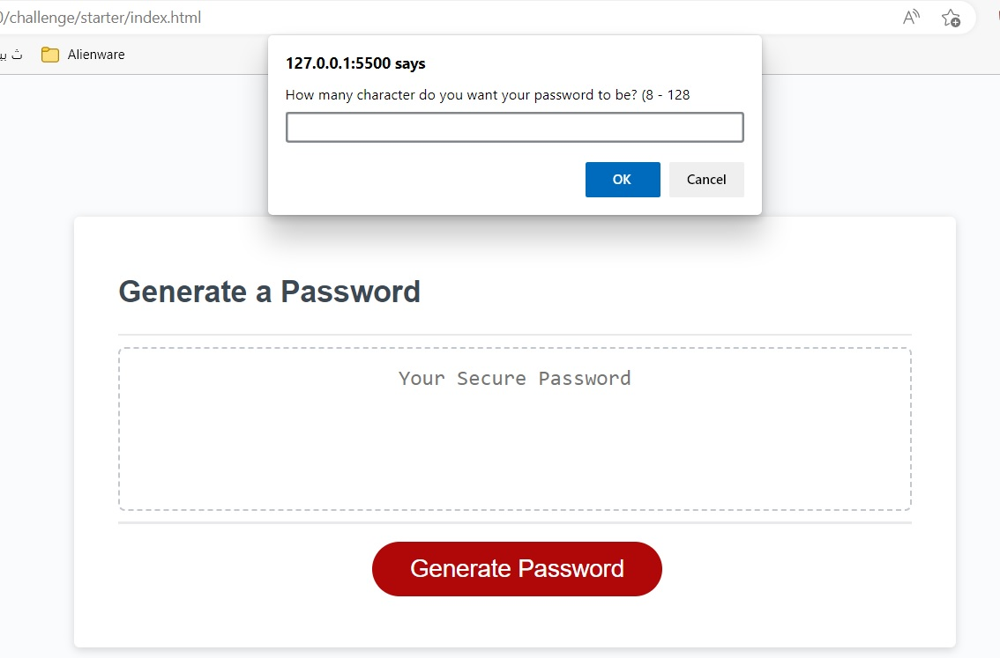
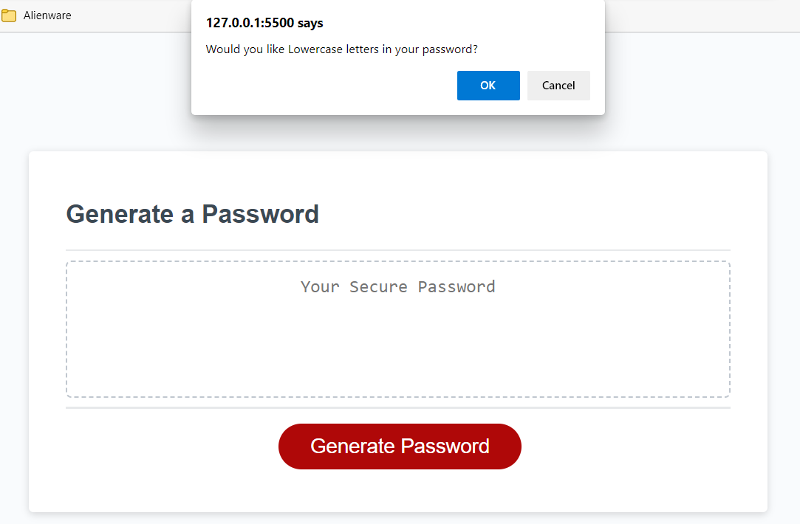
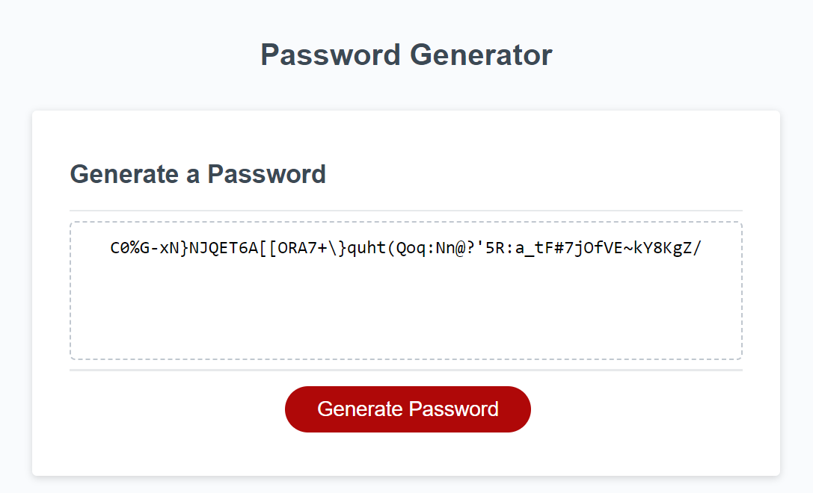

# # Module 5 Challenge: Password Generator
Bootcamp Module 5 challenge for students

## Description

This Module 5 challenge was created for bootCamp students to create an application that an employee can use to generate a random password based on criteria they’ve selected by modifying starter code. This app will run in the browser, and feature dynamically updated HTML and CSS powered by JavaScript code that you write. It have a clean and polished user interface that is responsive, ensuring that it adapts to multiple screen sizes.

## Instructions

The following image shows the web application's appearance and functionality:

* Generate a password when the button is clicked
  * Present a series of prompts for password criteria

20
    * Length of password
      * At least 10 characters but no more than 64.
    * Character types
      * Lowercase
      * Uppercase
      * Numeric
      * Special characters ($@%&*, etc)
     

  * Code should validate for each input and at least one character type should be selected
  * Once prompts are answered then the password should be generated and displayed in an alert or written to the page

## Installation

N/A

## Usage

To use this Module 5 Password Generator, you can go to the link of the website and you can see the result.

## Credits

N/A

## License

Please refer to the LICENSE in the repo.